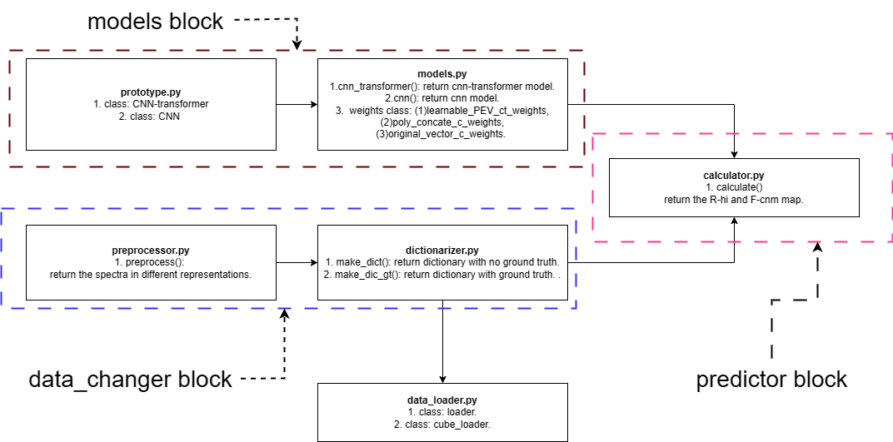
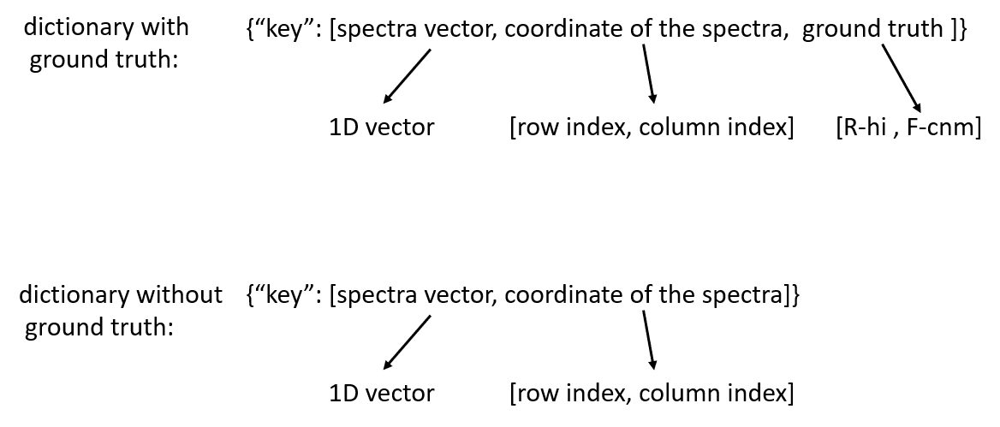

# tano_signal
The package used for HI spectra property extraction.

| Methods   | Return valu | Description   |
| :---      |    :----:   |          ---: |

 spectra_cnn_transformer() | CNN-transformer | get CNN-transformer model|
 spectra_cnn() | CNN     |  get CNN model |
 calculate() |  Rhi and Fcnm map  | calculate Fcnm and Rhi map |
 make_dict_gt() | dictionary with ground truth     |  get dictionary with ground truth. |
 make_dict() | dictionary without ground truth    | get dictionary without ground truth.  |
 preprocess() |   spectra with PEV | process 1D data by different PEV input string. |

In order to simplify 1D signal processing, we developed a Python package called tano\_signal that integrates the important functionalities in the one-dimensional data processing. The package consists of three blocks, namely the model block, data\_changer block, and predictor block. Each block is a file that contains one or two .py files to realize certain functionalities. The package structure is illustrated in Figure \ref{figure 68}.  

In the model block, we build two Python files, prototype.py and models.py.  prototype.py contains two classes, CNN-transformer and CNN that are used for model construction. Both models have eight convolution layers. In CNN-transformer class, we canceled the functionality of adding trainable PEV to the input of the transformer. The following image illustrates how to initialize two model.   

The file models.py contains three classes, trainable_PEV_ct_weights, original_vector_c_weights, and poly_concate_c_weights. All the weight classes are the pre-trained weights based on two data cubes in experiment 3 and experiment 4. trainable_PEV_ct_weights is the weights based on cnn-transformer with trainable PEV added to the CNN input. poly_concate_c_weights is the weights based on CNN with polynomial feature concatenate to the original vector at axis 1. original_vector_c_weights is the weight based on the original vector in CNN. We also realized two methods in models.py, spectra_cnn_transformer and spectra_cnn. Users can use prototype.py and modelss.py to construct a CNN or CNN-transformer model with pre-trained weights.  

Another part is the calculator part, which is used for making predictions on the datacube. This part contains only one file, calculator.py. This file has single functionality called calculate(). This function will return R-hi and F-cnm map based on the input data cube and model. It is purely used for the calculation of R-hi and F-cnm for data cube. The following figure illustrates the inputs of the calculate() method. The PEV inputs will be one of the PEV string in the Table \ref{table 12}.  

Another important file is the dictionarizer.py. It has a class called dict_maker and this class contains two methods, make_dict() and make_dict_gt(). make_dict() will make a dictionary with no ground truth based on the data cube. make_dict_gt() will make a dictionary based on the data cube and R-hi and F-cnm ground truth. The structure of the dictionary is illustrated in Figure \ref{figure 72}.  The dictionary with ground truth can be used with training and prediction. A dictionary with no ground truth can only be used for prediction. We have already integrated the make_dict() method in calculate() method, users will not need to call make_dict() to get the prediction of the data cube.  

