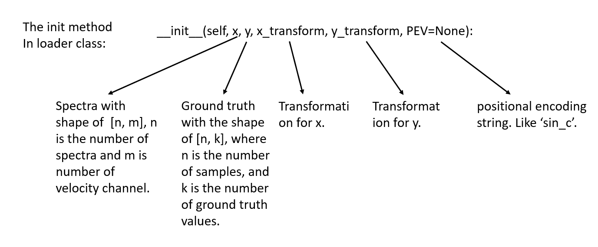

# tano_signal
The package used for HI spectra property extraction.

In order to simplify 1D signal processing, we developed a Python package called tano_signal that integrates the important functionalities in the one-dimensional data processing. The package consists of three blocks, namely the model block, data_changer block, and predictor block. Each block is a file that contains one or two .py files to realize certain functionalities. The package structure is illustrated in the above figure.  

| Methods   | Return valu | Description   |
| --------      |    --------   |  --------------- |
|spectra_cnn_transformer() | CNN-transformer | get CNN-transformer model|
|spectra_cnn() | CNN     |  get CNN model |
 |calculate() |  Rhi and Fcnm map  | calculate Fcnm and Rhi map |
 |make_dict_gt() | dictionary with ground truth     |  get dictionary with ground truth. |
 |make_dict() | dictionary without ground truth    | get dictionary without ground truth.  |
 |preprocess() |   spectra with PEV | process 1D data by different PEV input string. |

In the model block, we build two Python files, prototype.py and models.py.  prototype.py contains two classes, CNN-transformer and CNN that are used for model construction. Both models have eight convolution layers. In CNN-transformer class, we canceled the functionality of adding trainable PEV to the input of the transformer. The following image illustrates how to initialize two model.   

The file models.py contains three classes, trainable_PEV_ct_weights, original_vector_c_weights, and poly_concate_c_weights. All the weight classes are the pre-trained weights based on two data cubes in experiment 3 and experiment 4. trainable_PEV_ct_weights is the weights based on cnn-transformer with trainable PEV added to the CNN input. poly_concate_c_weights is the weights based on CNN with polynomial feature concatenate to the original vector at axis 1. original_vector_c_weights is the weight based on the original vector in CNN. We also realized two methods in models.py, spectra_cnn_transformer and spectra_cnn. Users can use prototype.py and modelss.py to construct a CNN or CNN-transformer model with pre-trained weights.  

Another part is the calculator part, which is used for making predictions on the datacube. This part contains only one file, calculator.py. This file has single functionality called calculate(). This function will return R-hi and F-cnm map based on the input data cube and model. It is purely used for the calculation of R-hi and F-cnm for data cube. The following figure illustrates the inputs of the calculate() method. The PEV inputs will be one of the PEV string in the Table below.  

| PEV string   | Meaning   |
| --------      |    --------   | 
|index_c | concatenate index PEV at axis 1. | 
|index_a | add index PEV to the original vector.  |
|sin_a |  add sinusoidal PEV to the original vector. |
|sin_c | concatenate sinusoidal PEV at axis 1.  |
|poly_c | concatenate polynomial feature at axis 1.  |
|None or other |  original vector. |
 
 
 
The third block is the data changer block. This block contains three Python files, preprocessor.py
and dictionarizer.py. The most basic file is the preprocessor file. It contains only one method called
preprocess() that can transform spectra data into different data representations depending on the input
data representation string. The PEV input will decide which data transformation to apply.
It will be one of the PEV string in the table in above. The image below illustrates how to use this methdo.  

Another important file is the dictionarizer.py. It has a class called dict_maker and this class contains two methods, make_dict() and make_dict_gt(). make_dict() will make a dictionary with no ground truth based on the data cube. make_dict_gt() will make a dictionary based on the data cube and R-hi and F-cnm ground truth. The structure of the dictionary is illustrated in Figure below. The dictionary with ground truth can be used with training and prediction. A dictionary with no ground truth can only be used for prediction. We have already integrated the make_dict() method in calculate() method, users will not need to call make_dict() to get the dictionary.  

Considering that further experiments may be needed on different data cubes, we also implement the
data loader python file to help the training. our data loader has two classes, loader, and cube loader.
The first class is used for loading discrete spectra (no special information) and the second class is used
for loading data cubes. Users can call one of the two methods to load the data. The initialization
values for the loader and cube loader are shown in the following two figures. 

Figure below illustrates the processes of applying tano_signal into cubic data prediction and calculation. Data cube will be transfered to a dictionary with or without ground truth. This process will be realized by the data_changer package. If the dictionary is used for making prediction, it will be transmitted into calculator to generate R-hi and F-cnm maps. If this dictionary is used for training, it will be transmitted into data loader to feed into model. The first table at the very beginning illustrates all the methods output inside tano_signal package.  

Please note that most of the packages are designed for data cube processing. For discrete 1D data, three Python files: preprocessor, model, and data_loader have already covered all the required functionalities in training, preprocessing, and prediction. Also, we only implement three pre-trained weights classes, one for the CNN-transformer and two for CNN. we expected that these three weights should be able to satisfy the basic requirements for prediction. For more advanced usage, Users can train the weights by themselves and use them for prediction. Also, this package is intended for data with 101 channels, for data with other channels, users need to reshape data to 101 channels. Otherwise the training accuracy will be affected.  

